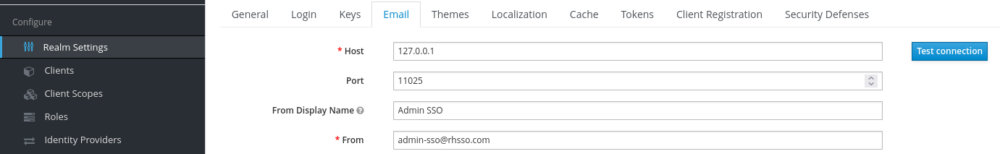
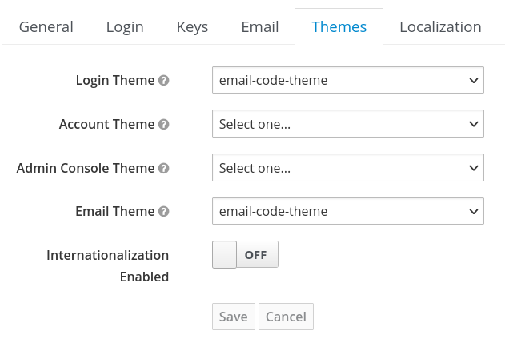
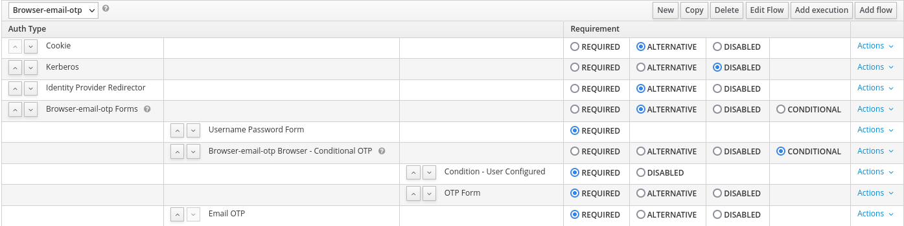

# 🔒 Keycloak 2FA Email Authenticator

Keycloak Authentication Provider implementation to get a two factor authentication with an OTP/code/token send via Email (through SMTP).

When logging in with this provider, you can send a verification code (OTP) to the user's e-mail address.
Tested with Keycloak version 19.x (and Red Hat Single Sign-On 7.6), if you are using different Keycloak version, don't forget to change the
version in `pom.xml` file.

The [Server Development part of the Keycloak reference documentation](https://www.keycloak.org/docs/latest/server_development/index.html) contains
additional resources and examples for developing custom Keycloak extensions.

# 🚀 Deployment

## Provider

To build the package (jar file):

```shell
mvn package
```

Copy it into `deployments` folder of Red Hat Single Sign On:

```shell
cp target/keycloak-2fa-email-authenticator.jar $RHSSO_HOME/standalone/deployments/
```

Or the recommended Wildfly Maven Plug-in (review the configuration in the `pom.xml` file):

```shell
mvn wildfly:deploy
```

## Theme Resources

There are a set of theme resources in the `src/main/resources/theme` folder as templates for the emails:

**email-code-theme/email/html/code-email.ftl** is a html email template (_themes/base/email/html/_)
**email-code-theme/email/text/code-email.ftl** is a text email template (_themes/base/email/text/_)
**email-code-theme/email/messages/*.properties** include translations for the email templates (Append to _themes/base/email/messages/messages_en.properties_
**email-code-theme/login/email-code-form.ftl** is a form template for the Email OTP (_themes/base/login)

The folder includes more resources as it is an copy of the original `base` and `keycloak` themes to include all the
resources needed.

This theme is already included in the package created and deployed following the instructions described above.

# Configuration

## Email Server

**NOTE**: Just only for local testing purposes

[MailCatcher](https://mailcatcher.me/) runs a super simple SMTP server which catches
any message sent to it to display in a web interface. Run mailcatcher, set your
favourite app to deliver to `smtp://127.0.0.1:1025` instead of your default SMTP server,
then check out `http://127.0.0.1:1080` to see the mail that's arrived so far.

There is a way to run locally using a podman container with this command:

```shell
podman run -d --name mailcatcher -p 18080:8080 -p 11025:1025 quay.io/sshaaf/mailcatcher
```

This command will expose locally the following ports:

* `http://127.0.0.1:18080` for see the emails
* `smtp://127.0.0.1:11025` for server SMTP endpoint

## Email Configuration

The Email configuration in Red Hat Single Sign-On is defined at realm level, similar
this screenshot:



## Theme Configuration

The Theme configuration in Red Hat Single Sign-On is defined at realm level, similar
this screenshot:



## Authentication Flow

Adding the new Email OTP requires to create a new authentication flow (for example coping the
`browser` one) and adding a new execution before the `Username Password Form` execution. The
new execution will use the `Email OTP` provider.

The authentication flow will be similar to:



**NOTE:** Remember to bind the new authentication flow for the Browser Flow.

Now, the user after providing the user and password credentials will receive a email with
a OTP token to add in the next form:


